# How The-Decider picks the next task

A walkthrough of the selection pipeline, from "open the app" to "this card appears."

---

## 1. Top-level flow

Every time the queue refreshes (app open, swipe, mode change, snooze, screen resume), this pipeline runs.

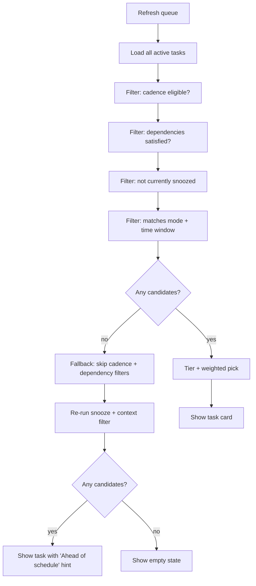

The fallback path is the ADHD-friendly hook: if you're "caught up" on cadence, you still get a card with a small *"Ahead of schedule — early start"* label so the app never tells you to come back later.

---

## 2. Cadence eligibility

Each task has a cadence with a `cadenceDays` value:

| Cadence    | `cadenceDays` |
|------------|---------------|
| DAILY      | 1             |
| BIDAILY    | 2             |
| WEEKLY     | 7             |
| BIWEEKLY   | 14            |
| MONTHLY    | 30            |
| BIMONTHLY  | 60            |
| ANYTIME    | `null`        |
| ONEOFF     | `null`        |

A task is **cadence-eligible** when enough time has passed since it was last done (or since it was created, if never done).

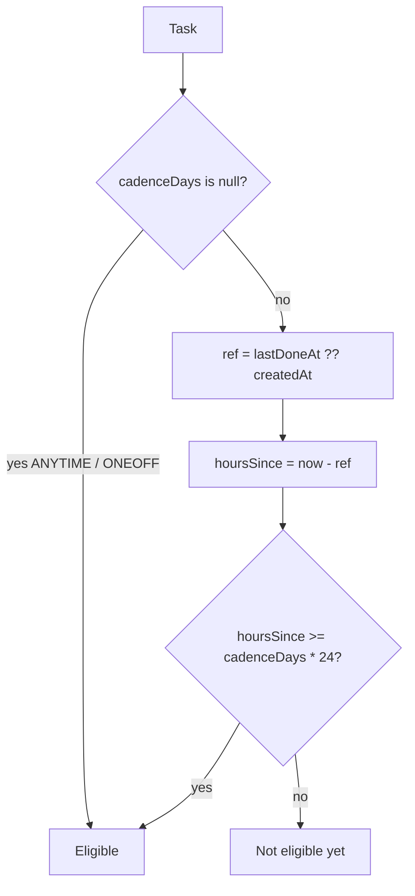

Example: Vacuum is DAILY (1). Done at 10 a.m. yesterday → eligible again at 10 a.m. today.

---

## 3. Dependency check

Some tasks declare prerequisites in `SeedDependencies.byTitle`. A dependent is held until its prerequisite is *fresh*.

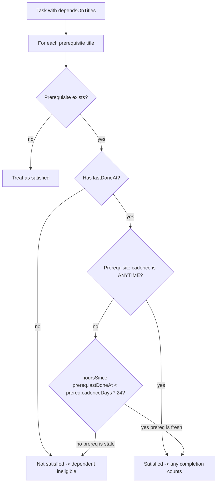

Currently seeded:

| Dependent      | Requires                          |
|----------------|-----------------------------------|
| Mop the floor  | Vacuum downstairs and upstairs    |

Mop only appears in the queue if Vacuum was done within the last 24 hours.

---

## 4. Snooze filter

Snoozes have an `until` timestamp. While `until > now`, the task is hidden.

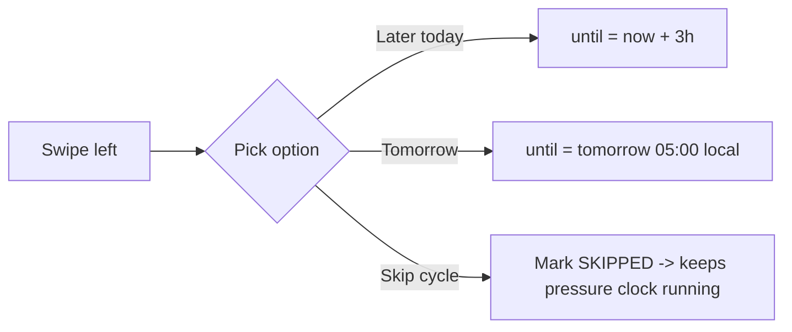

`Skip cycle` does *not* add a snooze — it records a `SKIPPED` completion so the task drops off the surface but pressure keeps mounting. (Reread `PressureCalculator`: only `DONE` completions reset the pressure clock; the reference timestamp uses `lastDoneAt`, which means `lastOfType(DONE)`.)

---

## 5. Context filter (mode + time of day)

Each task has a `timeWindow` (MORNING / AFTERNOON / EVENING / ANYTIME) and the user may pick a mode chip (All / Low energy / 10 min / Quick).

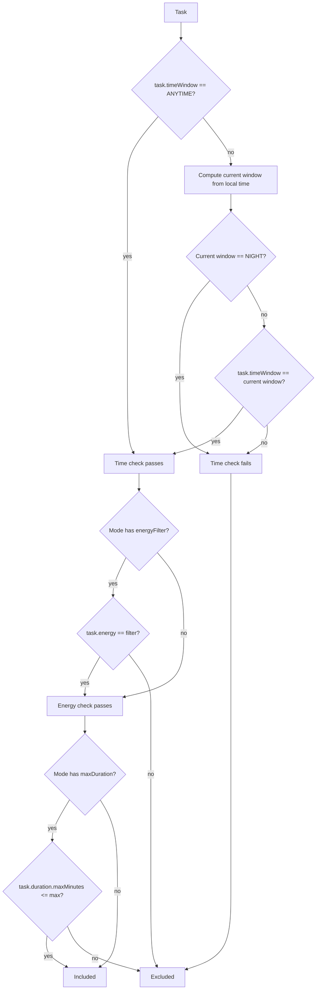

Time windows:

| Window     | Local hours |
|------------|-------------|
| MORNING    | 05:00–11:59 |
| AFTERNOON  | 12:00–16:59 |
| EVENING    | 17:00–22:59 |
| NIGHT      | 23:00–04:59 |

Mode chips:

| Chip        | Effect                                  |
|-------------|-----------------------------------------|
| All         | no filter                               |
| Low energy  | only `energy = LOW`                     |
| 10 min      | only `duration <= SHORT` (≤15 min)      |
| Quick       | only `duration <= QUICK` (≤5 min)       |

---

## 6. Pressure

Pressure quantifies "how overdue" a task is, normalized by its own cadence.

```
pressure = max(0, (daysSinceRef - cadenceDays) / cadenceDays)
```

- Just done: `daysSinceRef ≈ 0` → `pressure = 0`
- Done exactly on cadence boundary: `pressure = 0`
- One full cadence overdue (e.g., daily task last done 2 days ago): `pressure = 1.0`
- Two cadences overdue: `pressure = 2.0`
- ANYTIME tasks: fixed `0.05` (always selectable but low priority)

**Tier escalation** (current rule):
- `pressure == 0` → IN_WINDOW
- `pressure > 0` (any past-due, even 1 day late on a monthly) → OVERDUE
- ANYTIME / ONEOFF → ANYTIME

A monthly task overdue by 5 days enters OVERDUE immediately rather than waiting 60 days for `pressure > 1.0`.

Pressure feeds two things:
- **Tier** for selection bucketing
- **Tint** on the task card (visible only as color, not as a number)

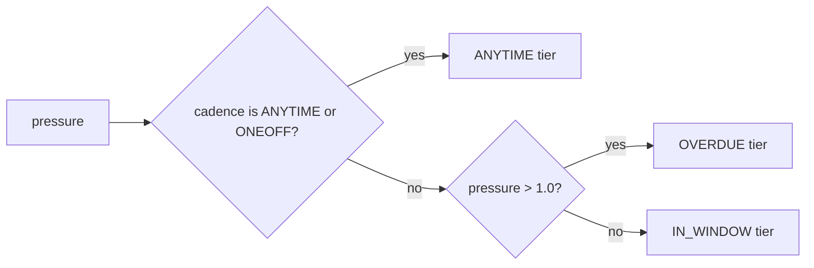

---

## 7. Selection (tiering + weighted pick)

After all filters, candidates are split into tiers and the highest non-empty tier is sampled.

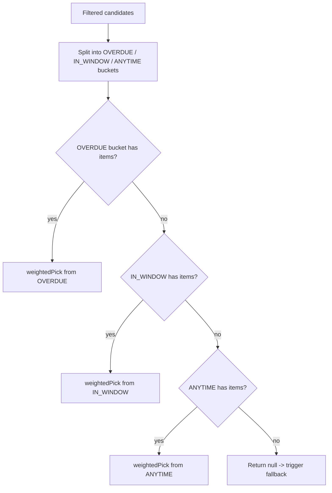

`weightedPick`: each task in the bucket gets a weight based on **absolute days late** with sqrt damping, so cadences compete fairly:

```
weight = sqrt(pressure × cadenceDays) + 1.0     // for cadence tasks
weight = pressure + 1.0                         // for ANYTIME (no cadence)
```

Worked weights:

| Task                       | daysLate | weight                |
|----------------------------|----------|-----------------------|
| Daily, +1 day late         | 1        | sqrt(1) + 1 = 2.00    |
| Weekly, +3 days late       | 3        | sqrt(3) + 1 = 2.73    |
| Weekly, +7 days late       | 7        | sqrt(7) + 1 = 3.65    |
| Monthly, +5 days late      | 5        | sqrt(5) + 1 = 3.24    |
| Monthly, +30 days late     | 30       | sqrt(30) + 1 = 6.48   |

Effect: a monthly task that's two weeks past its cycle now outweighs a daily task that's only one day past. Without sqrt damping a 30-day-late monthly would obliterate everything else; with it, urgency rises but the queue stays varied.

---

## 8. Fallback (early start)

When the eligible candidate list is empty (everything's fresh), the ViewModel runs the selection again over **all active tasks** — bypassing the cadence and dependency filters, but still respecting snooze and context. If a task is picked this way, the card shows *"Ahead of schedule — early start."*

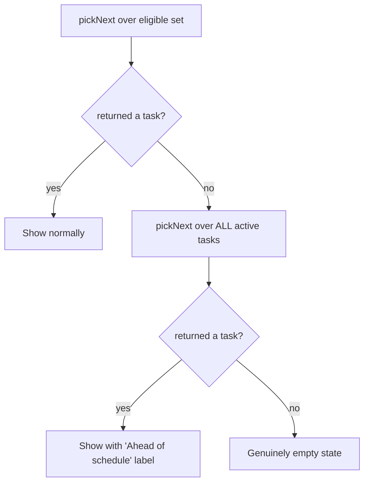

`G` only triggers when literally no active task matches the current context (e.g., NIGHT and you have zero ANYTIME tasks, or every task is snoozed).

---

## 9. End-to-end example

Walk through a concrete morning.

**Setup at 09:00 local:**
- 18 daily tasks, all active.
- You did `Vacuum downstairs and upstairs` at 17:00 yesterday (16 h ago).
- You did `Brush teeth night` at 22:00 yesterday (11 h ago).
- Everything else: never done since install 3 days ago.
- Mode: `All`. No snoozes.

**Pipeline:**

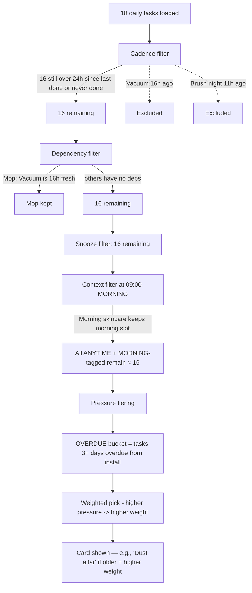

Tomorrow at 09:00 after doing everything tonight: queue runs again, almost everything is cadence-eligible (24 h passed), the OVERDUE bucket is empty, IN_WINDOW gets sampled, and you see a freshly-rotated task.

---

## 10. After selection: the per-step timer

Once you start a task, each step can have a `durationSeconds` target. In **Focus mode** (toggle in the task detail top bar), one step is shown at a time alongside a timer. The timer is gentle pressure, not a strict deadline.

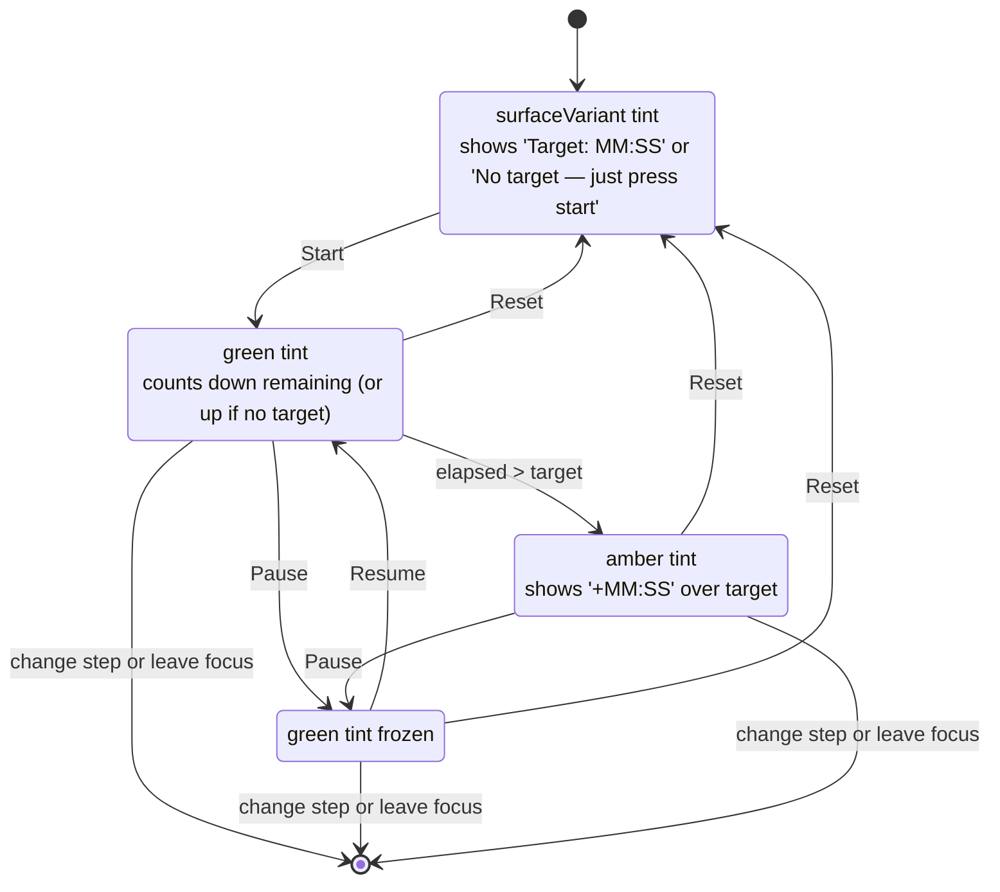

Behavior notes:

| Aspect              | Detail                                                                 |
|---------------------|------------------------------------------------------------------------|
| Target source       | `StepEntity.durationSeconds` (set in `SeedSteps.kt`)                   |
| Tick rate           | 100 ms (smooth countdown, low CPU)                                     |
| No-target steps     | Timer becomes a plain stopwatch — counts up only                       |
| Overrun visual      | Background flips to amber, label shows `+MM:SS` past target            |
| Per-step state      | `running`/`elapsedMs` are keyed by `step.id` — switching step resets   |
| Persistence         | None — pause/exit loses the elapsed time. Intentional: it's a nudge, not a tracker |

The Done-with-step button is independent of the timer — you can mark a step done before the target runs out, or let it overrun and still mark it done. The timer never blocks completion.

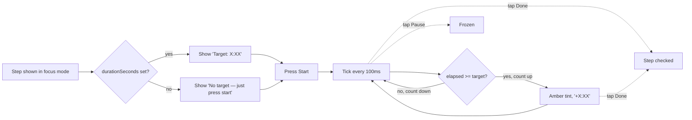

The point: the timer is a **prompt**, not a stopwatch you have to satisfy. ADHD-friendly framing — most steps in `SeedSteps.kt` are intentionally a touch tight so the running clock creates light forward momentum without becoming a deadline you can fail.

---

## 11. Quick reference: what triggers a refresh?

| Event                              | Triggers refresh? |
|------------------------------------|-------------------|
| App opens / resumes                | yes               |
| Swipe right (start task)           | yes (after detail) |
| Swipe left → Later/Tomorrow/Skip   | yes               |
| Mode chip change                   | yes               |
| Task completed via Done button     | yes (on return)   |
| Custom task added via QuickAdd     | yes               |
| Settings change                    | next refresh      |
| Nudge fired                        | no (separate path)|

---

## File map

| Concern                | File                                                          |
|------------------------|---------------------------------------------------------------|
| Pipeline orchestration | `ui/queue/QueueViewModel.kt`                                  |
| Cadence + dependency   | `data/repo/TaskRepository.kt#listEligibleForSelection`        |
| Pressure               | `domain/select/PressureCalculator.kt`                         |
| Tier                   | `domain/model/PressureTier.kt`                                |
| Context filter         | `domain/select/ContextFilter.kt`                              |
| Tier + weighted pick   | `domain/select/SelectionService.kt`                           |
| Snooze rules           | `data/repo/SnoozeRepository.kt`                               |
| Seed dependencies      | `data/seed/SeedDependencies.kt`                               |
| Mode chips             | `domain/select/ModeChip.kt`                                   |
| Time windows           | `domain/model/TimeWindow.kt`                                  |
